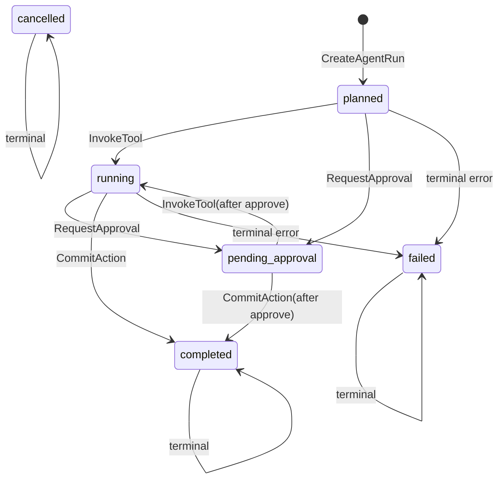
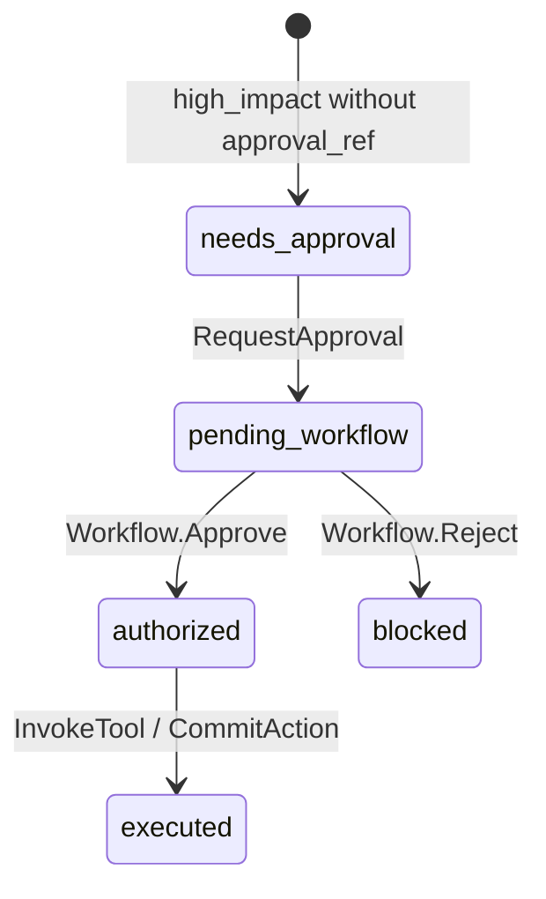

# AI Runtime State Machines

**文档 ID：** SM-AI-001  
**版本：** 1.0  
**里程碑：** PHX-A12  
**状态：** Accepted

## 1. Agent Run

```mermaid
stateDiagram-v2
    [*] --> planned: CreateAgentRun
    planned --> running: InvokeTool
    planned --> pending_approval: RequestApproval
    running --> pending_approval: RequestApproval
    running --> completed: CommitAction
    pending_approval --> running: InvokeTool(after approve)
    pending_approval --> completed: CommitAction(after approve)
    planned --> failed: terminal error
    running --> failed: terminal error
    completed --> completed: terminal
    failed --> failed: terminal
    cancelled --> cancelled: terminal
```

## 2. High-impact Tool / Commit

```mermaid
stateDiagram-v2
    [*] --> needs_approval: high_impact without approval_ref
    needs_approval --> pending_workflow: RequestApproval
    pending_workflow --> authorized: Workflow.Approve
    authorized --> executed: InvokeTool / CommitAction
    pending_workflow --> blocked: Workflow.Reject
```
