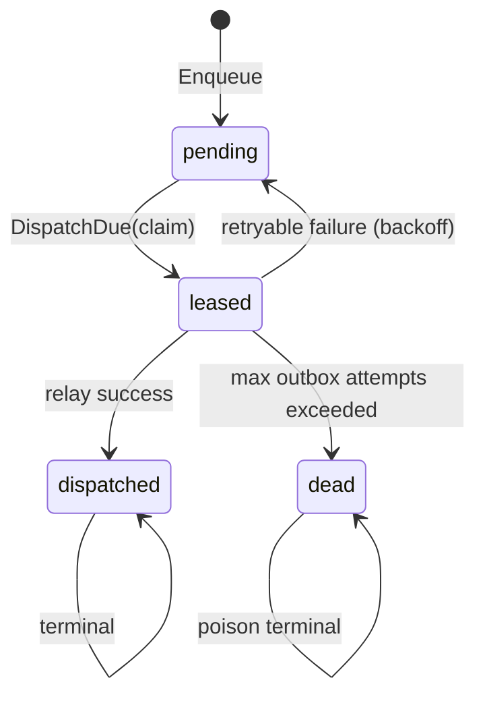
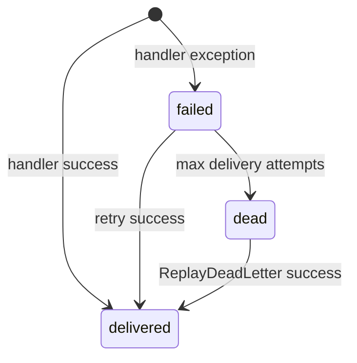
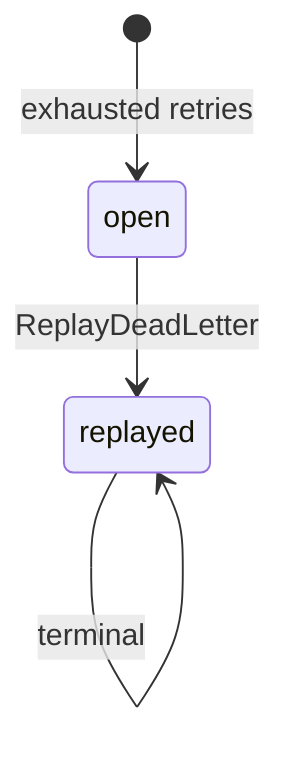

# Event Bus State Machines

**文档 ID：** SM-EVENT-001  
**版本：** 1.0  
**里程碑：** PHX-P11  
**状态：** Accepted

## 1. Outbox

- Enqueue 仅写 outbox，不调用内投递。
- Claim 设置 `leased_by` / `leased_until`；租约过期可被回收。
- Relay 预分配 `event_id` 幂等写入 `events` 后执行投递。

## 2. Delivery Attempt

- `(subscriber_id, event_id)` 成功至多一次。
- `dead` 不再被普通 Replay 重投；需 DLQ 显式重放。

## 3. Dead Letter

