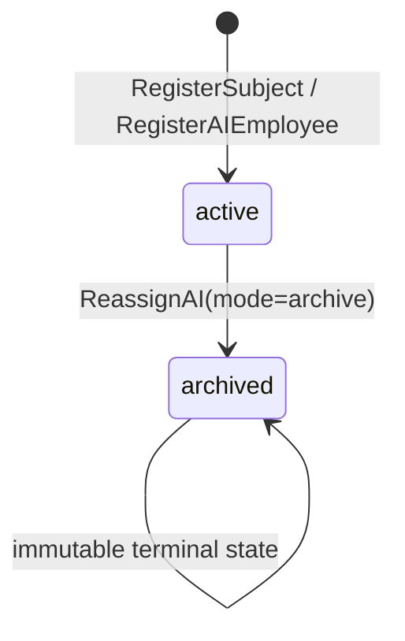
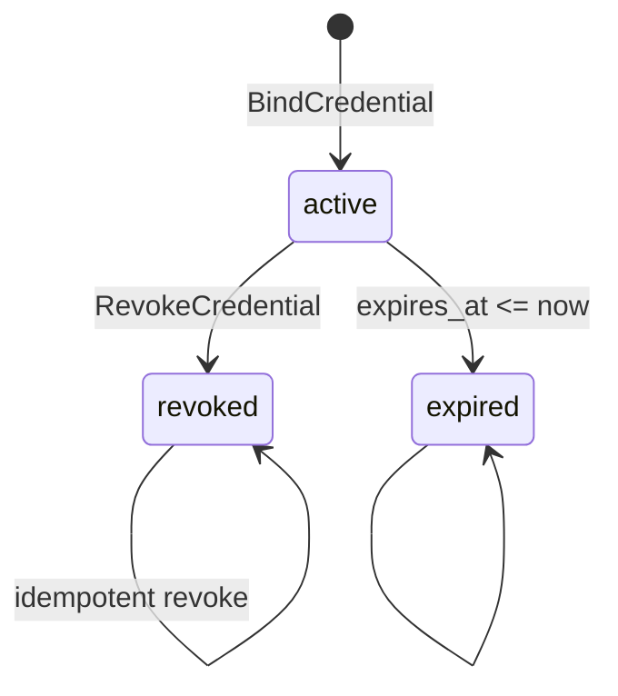
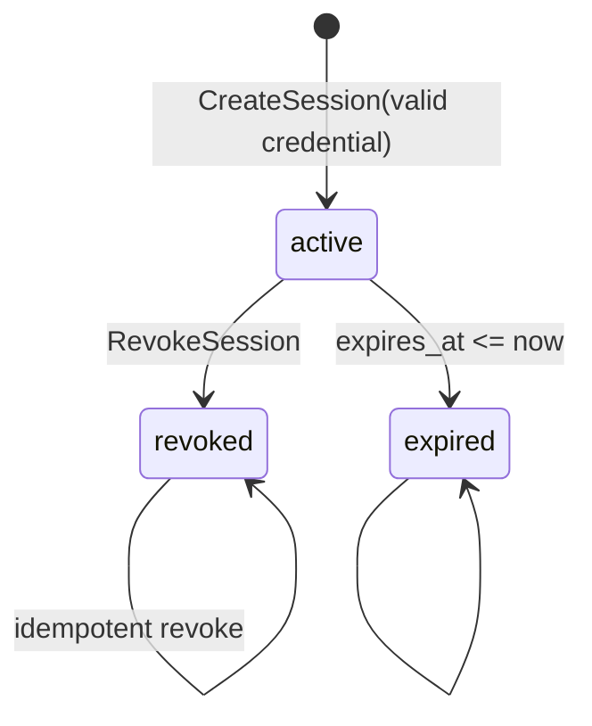
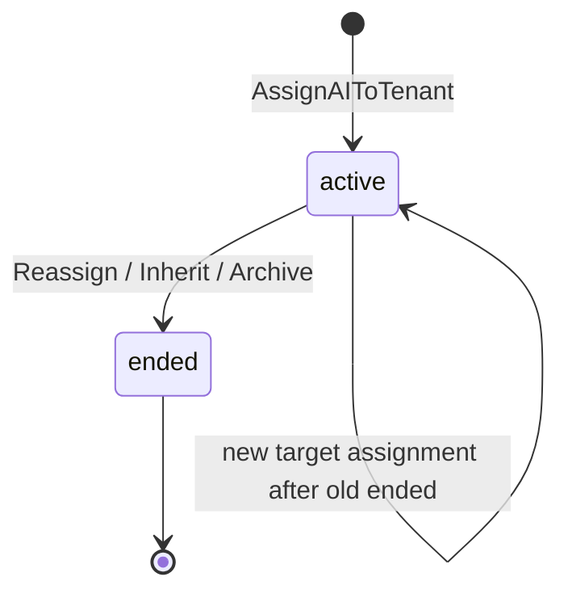
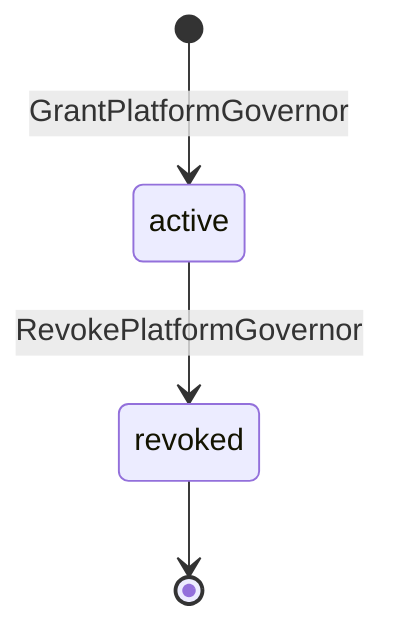

# Identity Kernel 状态机

**文档 ID：** SM-IDENTITY-001  
**版本：** 1.0  
**阶段：** PHX-006  
**状态：** 已实现契约的规范视图

## 通用规则

- 所有状态转换均在事务内完成并产生审计。
- 未列出的转换失败关闭。
- 时间到期是读取时计算的有效性状态，不反向改写不可变历史。
- Permission、Knowledge 与 Memory 状态不属于 Identity 状态机。

## Subject / AI Employee



- Foundation 不提供 archived → active 恢复。
- AI Subject 永久 ID 不因 assignment 结束而删除或复用。

## Credential



- `expired` 是校验视图，不是持久化枚举转换。
- revoked/expired credential 不得创建新 Session。
- revoke 不级联撤销既有 Session。

## Session



- Runtime 对 revoked、expired、not found 与绑定不匹配统一映射为 `CTX_INVALID`。

## AI Assignment



- 每个 AI 全局最多一个 active assignment。
- INHERIT 新记录引用 predecessor；不复制权限、知识、记忆或 Session。
- 跨租户转换经 L2 Coordinator 先结束旧 Organization memberships。

## Platform Identity Governor Grant



- 同一主体最多一个 active grant。
- 最后一个 active Governor 不得撤销。
- 存在持久 grant 后 bootstrap UUID 不再拥有隐式权限。

## AI Employee Profile

Profile 不使用生命周期枚举，使用单调版本状态：

```text
version N --UpdateAIProfile(expected_version=N)--> version N+1
```

- expected_version 不匹配返回 `IDENTITY_AI_PROFILE_CONFLICT`。
- assignment 转换不改变 Profile。

## 关联

- [IDENTITY_INTERFACE.md](IDENTITY_INTERFACE.md)
- [../api/identity.openapi.yaml](../api/identity.openapi.yaml)
- [ERROR_CODES.md](ERROR_CODES.md)
- [../decisions/ADR-0020-identity-api-contract.md](../decisions/ADR-0020-identity-api-contract.md)
