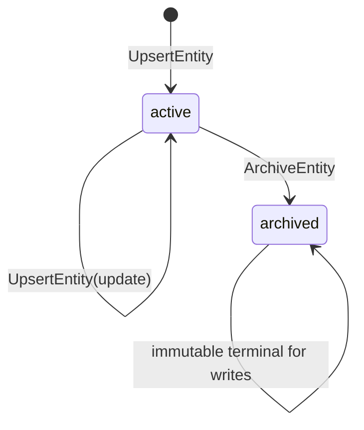
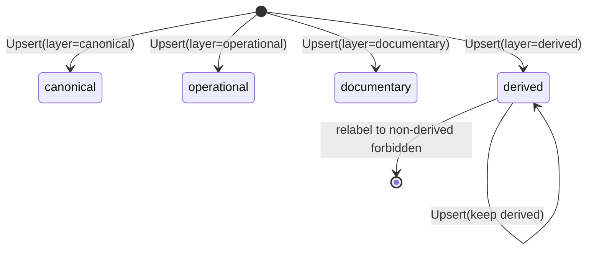
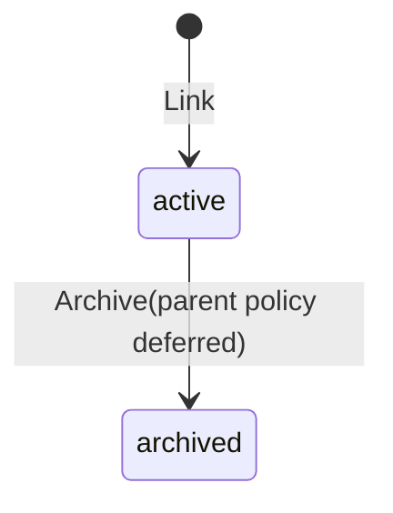

# Knowledge Shared Capability State Machines

**文档 ID：** SM-KNOWLEDGE-001  
**版本：** 1.0  
**里程碑：** PHX-K10  
**状态：** Accepted

## 1. Entity Retention

- Upsert 在 active 实体上按 `(tenant, entity_type, name)` 收敛；更新要求 `expected_version`。
- Archive 为软归档；写路径对 archived fail-closed。
- 可选 `retain_until`：到期后读取 fail-closed（`KNOWLEDGE_RETENTION_EXPIRED`）。
- 本里程碑不提供物理删除。

## 2. Layer Semantics

| Layer | 含义 | 约束 |
|-------|------|------|
| canonical | 规范事实 | 不得由 derived 原地伪装而来 |
| operational | 运行态知识 | 可更新 |
| documentary | 文档/政策引用 | 可归档 |
| derived | 推导/模型输出 | 写入必须标注；不可改层为非 derived |

## 3. Link

- Link 创建即 active；禁止自环。
- Link 归档执行器延后；K10 以 Entity 归档为主要 retention 路径。

## 4. Provenance

- 每次写入 append-only；无更新/删除状态机。
- `derived=true` 当且仅当 subject 为 derived entity 或显式派生操作记录。
