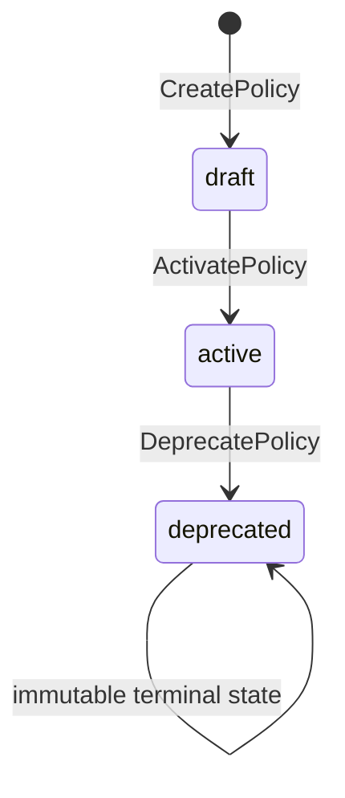
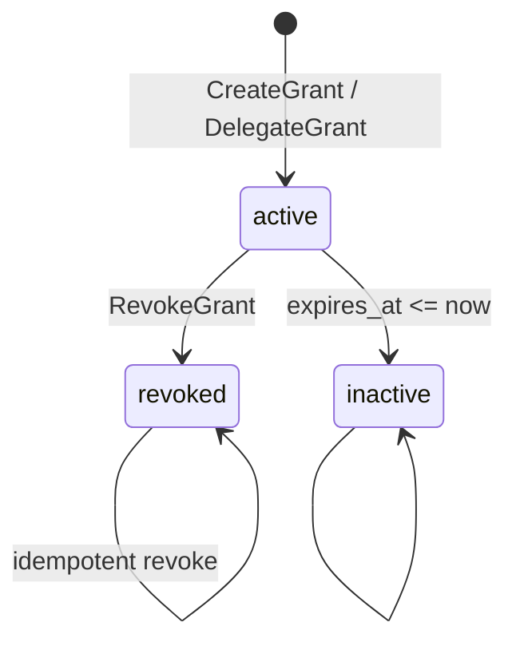
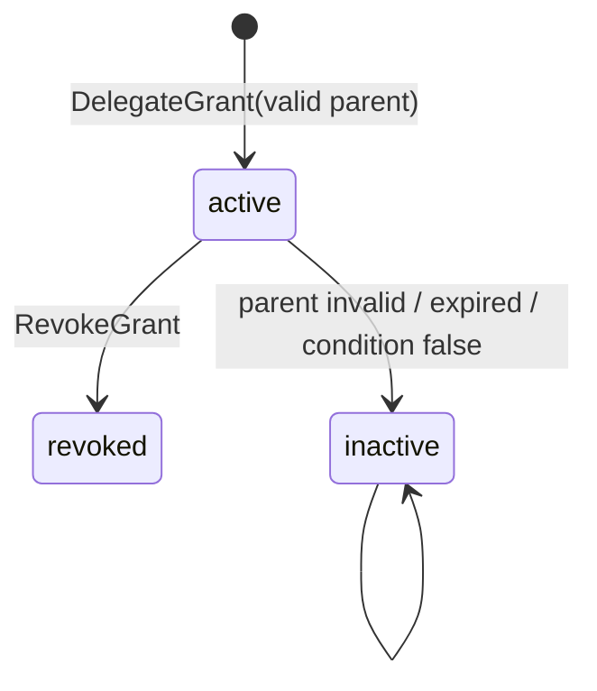

# Permission Kernel State Machines

**文档 ID：** SM-PERMISSION-001  
**版本：** 1.0  
**里程碑：** PHX-K08  
**状态：** Accepted

## 1. Policy



- Create 产生 DRAFT；ACTIVE 版本不可原地修改，变更必须发布新版本。
- Activate / Deprecate 要求 reason 与 `expected_version`。
- DEPRECATED 为终态；已 DEPRECATED 的 Policy 不参与运行时求值。
- 同一 Tenant 可并存多个 Policy 记录，但仅 ACTIVE 版本参与 Evaluate。

## 2. Grant



- Direct Grant 与 Delegated Grant 创建时均为 ACTIVE。
- Revoke 必须提供 reason 与 `expected_version`；REVOKED 为终态。
- `expires_at` 与 condition false 是读取时有效性，不反向改写历史记录。
- 父 Grant REVOKED / inactive 时，子 Delegation 立即不生效。

## 3. Delegation



- Delegation 产生带 `parent_grant_id` 的新 Grant，不修改父 Grant。
- Delegator 必须是父 Grant 的 Principal，且父 Grant 显式 `delegable=true`。
- Delegated actions、scope、expiry 与 remaining depth 只能等于或窄于父 Grant。
- `delegation_depth` 每次减一；为零时不可继续委派。
- 禁止循环 delegation；链路必须可解释、可审计。
- 父链任一 Grant revoked、expired、condition false 或 Principal 失效时，子 Grant 立即不生效。

## 4. Evaluate Combining

```text
collect matching rules and grants
  → any explicit DENY match? → deny (deny overrides)
  → else any ALLOW match? → allow
  → else → deny (default deny)
```

- Human approval 不改变 Permission effect；高影响动作在 ALLOW 后仍须独立通过 Workflow。
- condition unresolved / error 不产生 allow。
- Scope 由窄到宽：`RESOURCE < ORG_UNIT < ENTERPRISE < TENANT`；不得跨 Tenant。

## 5. 并发

所有更新命令要求 `expected_version >= 1`：

```text
stored.version == expected_version
  → apply transition
  → version = expected_version + 1
  → commit domain + audit atomically

stored.version != expected_version
  → PERMISSION_VERSION_CONFLICT
  → rollback
```

## 6. 错误映射

| 条件 | 错误码 |
|------|--------|
| 非法状态转换 | `PERMISSION_INVALID_STATE_TRANSITION` |
| stale version | `PERMISSION_VERSION_CONFLICT` |
| 跨 Tenant scope / grant | `PERMISSION_CROSS_TENANT_FORBIDDEN` |
| Principal 不符合 Identity eligibility | `PERMISSION_PRINCIPAL_INELIGIBLE` |
| Scope 无法由 Organization Resolver 验证 | `PERMISSION_SCOPE_INVALID` |
| condition unresolved / false | `PERMISSION_CONDITION_DENIED` |
| delegation 扩大 scope / actions / depth | `PERMISSION_DELEGATION_TOO_BROAD` |
| delegation 循环 | `PERMISSION_DELEGATION_CYCLE` |
| Explain / ListEffective 越权 | `PERMISSION_VISIBILITY_DENIED` |

## 7. 关联

- [Permission Interface](PERMISSION_INTERFACE.md)
- [Kernel Data Model](KERNEL_DATA_MODEL.md)
- [ADR-0023](../decisions/ADR-0023-permission-policy-scope-delegation.md)
- [PHX-K08 Architecture Gate](../project/PHX-K08_ARCHITECTURE_GATE.md)
