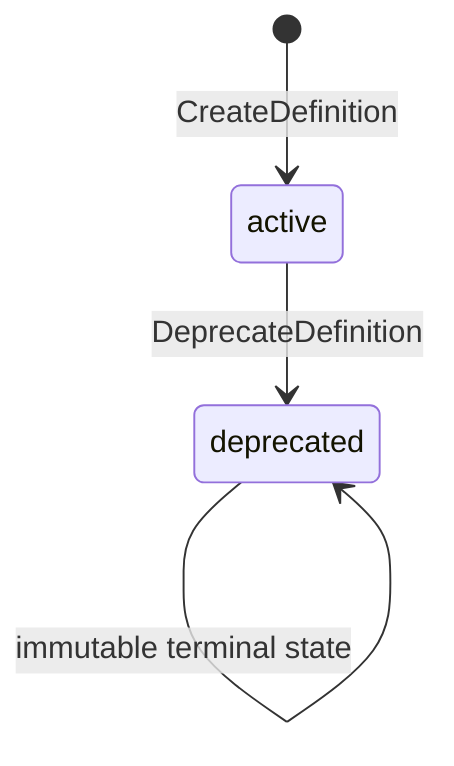
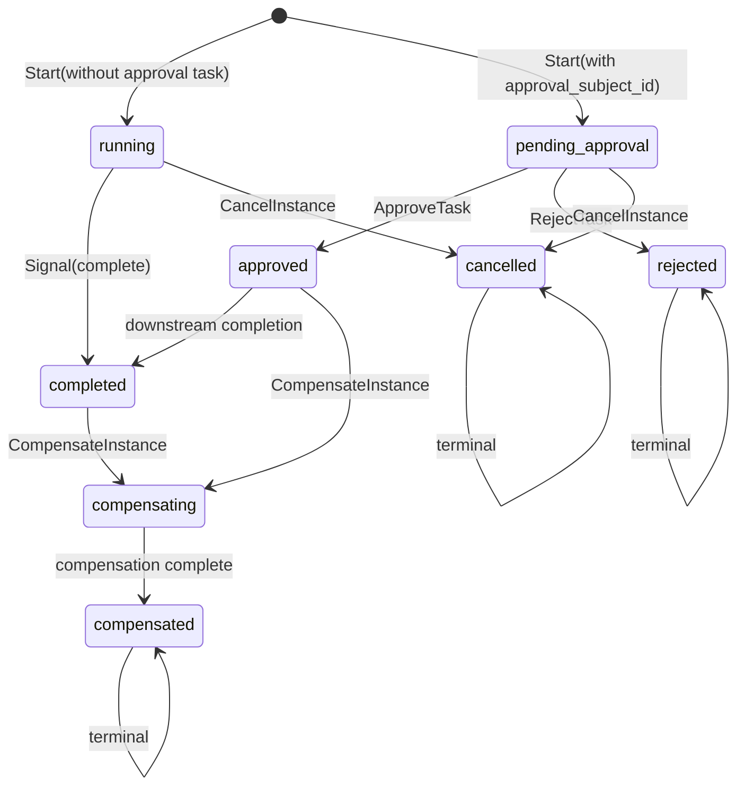
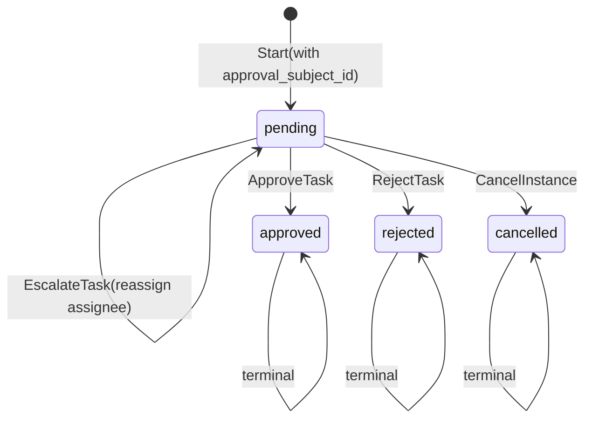

# Workflow Kernel State Machines

**文档 ID：** SM-WORKFLOW-001  
**版本：** 1.0  
**里程碑：** PHX-K09  
**状态：** Accepted

## 1. Definition



- Create 产生 ACTIVE；`(tenant|platform, name, version)` 唯一。
- ACTIVE 定义文档引用不可变；变更必须注册新版本。
- Deprecate 要求 reason 与 `expected_version`；DEPRECATED 不可 start。
- 平台级定义 `tenant_id` 可空；租户定义必须绑定 Tenant。

## 2. Instance



- `approval_subject_id` 存在时实例进入 `pending_approval` 并创建 PENDING 任务。
- Approve / Reject 同时更新 Instance 与 Task；要求 `expected_instance_version` 与 `expected_task_version`。
- Cancel 在终态（completed / cancelled / rejected / compensated）拒绝。
- Compensation 是显式命令，非自动 2PC；仅允许的路径进入 `compensating → compensated`。
- Compensation 不撤销 Permission Grant，也不自动回滚跨 Kernel 副作用。

## 3. Task



- Escalate 仅在 Instance `pending_approval` 且 Task `pending` 时允许；reason 必填。
- Escalate 改派 `assignee_subject_id` 并记录 `escalated_from_subject_id`。
- `due_at` 逾期默认 fail-closed：不得视为已批准；可 escalate 或 cancel。
- Approve 必须匹配 Instance `current_task_id` 与 binding 字段。

## 4. Signal Idempotency

```text
normalize(idempotency_key)
fingerprint = sha256(canonical(signal_name, payload))

prior receipt exists?
  same fingerprint → return prior resulting_status (success replay)
  different fingerprint → WORKFLOW_SIGNAL_CONFLICT

concurrent insert same key + fingerprint
  → loser converges to idempotent success (not conflict)

missing idempotency_key → WORKFLOW_IDEMPOTENCY_REQUIRED
```

- Signal 命令要求 `expected_version` 与 Instance 乐观锁对齐。
- 同键同指纹重放返回首次结果；同键不同指纹冲突。
- 并发插入同键同指纹时，败方应收敛为幂等成功而非误报冲突。

## 5. Dual Gate

```text
Permission.Evaluate(action, resource) → allow?
  no  → PERMISSION_DENIED (fail closed)
  yes → high-impact path requires Workflow approval?
          no  → proceed
          yes → instance APPROVED + binding match + not expired?
                  no  → WORKFLOW_APPROVAL_REQUIRED / AI_COMMIT_FORBIDDEN
                  yes → proceed to commit
```

- Permission allow 与 Workflow approval 是独立双闸门；allow 永不替代 approval。
- 批准绑定最少包含 `approval_principal_id`、`approval_action`、`approval_resource_ref`。
- `approval_plan_version`、`approval_scope`、`approval_expires_at` 可选，但一经提供即强制匹配。
- 绑定字段变更后，原 `approval_ref` 不可复用。

## 6. 并发

Instance / Task 更新命令要求 `expected_version >= 1`（或成对的 instance/task 版本）：

```text
stored.version == expected_version
  → apply transition
  → version = expected_version + 1
  → commit domain + audit atomically

stored.version != expected_version
  → WORKFLOW_VERSION_CONFLICT
  → rollback
```

同租户 `business_key` 活跃实例唯一；冲突返回 `WORKFLOW_BUSINESS_KEY_CONFLICT`。

## 7. 错误映射

| 条件 | 错误码 |
|------|--------|
| 非法状态转换 | `WORKFLOW_INVALID_STATE` |
| stale instance/task version | `WORKFLOW_VERSION_CONFLICT` |
| 活跃 business_key 冲突 | `WORKFLOW_BUSINESS_KEY_CONFLICT` |
| 跨 Tenant 操作 | `WORKFLOW_CROSS_TENANT_FORBIDDEN` |
| 未知 signal | `WORKFLOW_SIGNAL_UNKNOWN` |
| 幂等键冲突 | `WORKFLOW_SIGNAL_CONFLICT` |
| 缺少幂等键 | `WORKFLOW_IDEMPOTENCY_REQUIRED` |
| 非 assignee | `WORKFLOW_TASK_NOT_ASSIGNEE` |
| 批准过期 | `WORKFLOW_APPROVAL_EXPIRED` |
| 无权取消 | `WORKFLOW_CANCEL_FORBIDDEN` |

## 8. 关联

- [Workflow Interface](WORKFLOW_INTERFACE.md)
- [Kernel Data Model](KERNEL_DATA_MODEL.md)
- [ADR-0024](../decisions/ADR-0024-workflow-approval-truth.md)
- [ADR-0008](../decisions/ADR-0008-ai-human-approval.md)
- [PHX-K09 Architecture Gate](../project/PHX-K09_ARCHITECTURE_GATE.md)
