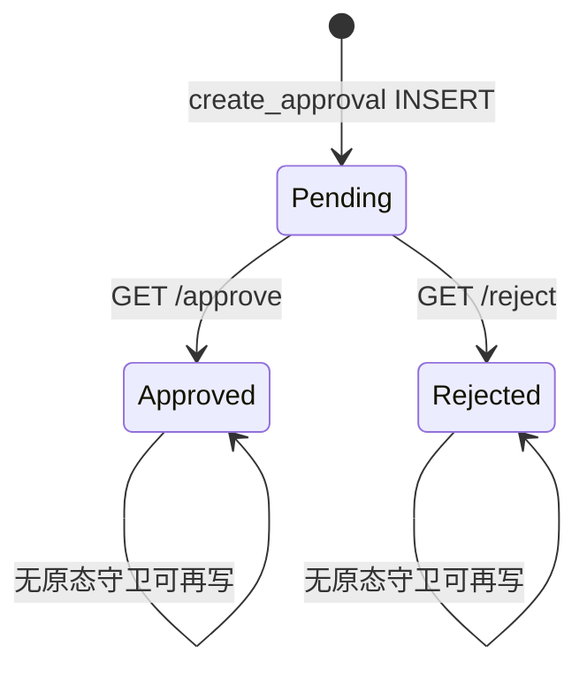

# Approval Center 运行时：路由 / 表 / 状态机

## Scope 与证据强度

本页固化活动 Approval Center 的 HTTP 面、持久化表与 Pending→决策状态机。强结论：S013 已把列表/详情/批准/拒绝迁入 `apps/approval/`；决策是 GET 写、只改 `approval_records`（可选写 `approval_history`），**不回调**业务对象。弱面：v14 residual 双注册、模块规格中的目标 POST/多路由、早期并行 DDL。

交叉引用：[`../governance/approval.md`](../governance/approval.md)（治理总览，不重写）。

## 业务规则（稳定 ID）

1. **ACR-R01** Hub 列表路由为 `GET /approvals`，渲染 `approvals.html`，注入 types、全部 records、按当前用户名过滤的 pending。
2. **ACR-R02** 详情为 `GET /approval/{approval_id}`，读单条 `approval_records` + 对应 `approval_history`。
3. **ACR-R03** 主批准为 `GET /approve/{approval_id}` → service `approve` → 303 `/approvals`。
4. **ACR-R04** 主拒绝为 `GET /reject/{approval_id}` → service `reject` → 303 `/approvals`。
5. **ACR-R05** 主批准/拒绝写 `approval_status`/`approval_result`/`finish_time`，并 `INSERT approval_history`（remark 固定空串）。
6. **ACR-R06** 备用 `GET /approve_record/{id}`、`/reject_record/{id}` 只更新记录，**不写历史**（S013 明确保留）。
7. **ACR-R07** 个人待办 = `approver == username` AND `approval_status='Pending'`；全表仍在同页展示。
8. **ACR-R08** 搜索按 `source_id`/`applicant`/`approver`/`source_type` 模糊匹配；无状态/日期结构化过滤。
9. **ACR-R09** 页面路由未见 `has_permission` / `can_approve` 调用；`permissions.py` 仅暴露 `scopes_for("approval")`。
10. **ACR-R10** `create_approval(...)` INSERT 初始 `approval_status='Pending'`，编号 `generate_no("APR")`。
11. **ACR-R11** 默认类型种子含 QUOTE / PURCHASE / PAYMENT / EXPENSE / LEAVE；`need_workflow` 默认 1。
12. **ACR-R12** Hub UI 对 Approve/Reject 使用浏览器 `confirm`；服务端无确认令牌。
13. **ACR-R13** Hub 诚实文案声明 AI 不自动批准；决策只改审批记录。
14. **ACR-R14** JSON API：`/api/approvals`、`/api/v2/approval/dashboard`、`/api/v2/approval/pending` 读统计/仪表盘/待办，不执行决策。
15. **ACR-R15** `apps/approval/routes.py` API scaffold（`/health`、`/records`、`/workspace`）与页面决策路径分离。
16. **ACR-R16** 更新 SQL 的 WHERE 仅 `id=?`，允许对非 Pending 记录重复决策（无条件更新）。

## 流程

1. （外部/辅助）调用 `create_approval` 或等价 INSERT → Pending 记录。
2. 用户打开 `/approvals`：看全量 KPI + My queue。
3. 打开 `/approval/{id}` 看字段与历史。
4. 点击 Approve/Reject（GET）：更新状态结果时间 →（主路径）插历史 → 回列表。
5. **业务来源对象是否同步释放：未见回调。**

## 校验（强/弱/缺失）

1. **ACR-V01（强）** 待办过滤 `approver=? AND approval_status='Pending'`。
2. **ACR-V02（缺失）** 操作者必须等于 `approver`：service/router 未见校验。
3. **ACR-V03（缺失）** 必须从 Pending 转换：UPDATE 无旧状态条件。
4. **ACR-V04（缺失）** 决策必须 POST/CSRF：活动路由为 GET。
5. **ACR-V05（强/主路径）** 主 approve/reject 写 `approval_history`。
6. **ACR-V06（缺失/备用）** `approve_record`/`reject_record` 不写历史。
7. **ACR-V07（缺失）** 拒绝原因必填：history remark 传 `""`。
8. **ACR-V08（缺失）** 来源业务对象存在性：`apps/approval/` 无跨模块查询。
9. **ACR-V09（弱）** UI 仅 Pending 行显示 Approve/Reject 按钮；服务端不强制。
10. **ACR-V10（弱）** `can_approve`/`can_view_approval`/`can_create_approval` 角色辅助存在于 legacy_support，**页面路由未调用**。
11. **ACR-V11（强）** Hub 绑定 `approval_records`/`pending_approvals`（A-022）。
12. **ACR-V12（缺失）** 页面 RBAC gate：活动 `router.py` 无 `has_permission`。

## 数据含义

| 数据 | Legacy 含义 |
|---|---|
| `approval_types.type_code` | 类型编码（QUOTE/PURCHASE/PAYMENT/…） |
| `approval_types.need_workflow` | 是否需要工作流标志；≠已实现引擎 |
| `approval_types.status` | 类型 Active，不是审批结果 |
| `approval_records.approval_no` | APR 业务编号 |
| `approval_records.source_module` / `source_no` | 来源域与单号引用（无 FK 校验） |
| `approval_records.applicant` / `approver` | 申请人 / 指定审批人（字符串用户名） |
| `approval_records.approval_status` | Pending / Approved / Rejected |
| `approval_records.approval_result` | 决策结果字段（与 status 同步写 Approved/Rejected） |
| `approval_records.finish_time` | 决策完成时间（运行 UPDATE 使用；初始 CREATE 清单未必含此列） |
| `approval_history.action_name` | Approved / Rejected |
| `approval_history.operator` | 执行者用户名 |
| `approval_history.remark` | 动作说明；主路径为空 |
| `approval_settings.*` | 种子配置（approval_required/auto_notify/allow_delegate/timeout） |
| `approval_delegation.*` | 委托 DDL；未见活动消费 |
| 早期 `approval_records(module_name,record_id,status…)` | 并行早期结构 |
| `approvals` 早期表 | Hub 已不再以该变量为主绑定（A-022） |
| 搜索字段 `source_id`/`source_type` | 搜索 SQL 使用；与 DDL `source_no`/`source_module` 命名存在演进差 |

## 状态词汇

| 状态 | 位置 | 含义 |
|---|---|---|
| Pending | approval_records | 待指定审批人处理 |
| Approved | records/history | 已批准 |
| Rejected | records/history | 已拒绝 |
| Active | approval_types/settings | 类型或设置可用 |
| Human Approved | V18/文案 | **不是**本表状态机状态 |

## 证据表

| ID | 观察事实 | 强度 | 只读来源路径 |
|---|---|---|---|
| ACR-E01 | 8 条页面路由声明（含 GET 写） | 强 | `apps/approval/router.py` |
| ACR-E02 | approve/reject 更新+历史编排 | 强 | `apps/approval/services.py` |
| ACR-E03 | Pending 待办 SQL 与无原态 UPDATE | 强 | `apps/approval/repository.py` |
| ACR-E04 | Hub 模板 confirm + AI 不自动批准 | 强 | `templates/approvals.html` |
| ACR-E05 | S013 迁移与备用无历史 | 强 | `APPROVAL_WORKFLOW_MIGRATION_S013.md` |
| ACR-E06 | A-022 Hub 诚实性与 human confirm | 强 | `docs/reports/Business_Strong_A022_Approval_Ops_Report.md` |
| ACR-E07 | DDL types/records/history/settings/delegation | 强 | `runtime/v14/legacy_support.py` |
| ACR-E08 | create_approval INSERT Pending | 强 | `runtime/v14/legacy_support.py` |
| ACR-E09 | JSON API 只读统计/pending | 强 | `apps/approval/approval_api.py` |
| ACR-E10 | 模块规格目标路由（含 POST）与现状差 | 弱/规格 | `business_modules/approval.md` |
| ACR-E11 | residual 仍含同源 approve/reject | 弱/双注册 | `apps/approval/v14_residual.py` |
| ACR-E12 | 页面 permissions 未接线到路由 | 强 | `apps/approval/permissions.py` + `router.py` |

## UNKNOWN + 已查路径

1. **页面路由与 v14_residual 双注册时实际匹配优先级 UNKNOWN。** 已查：`apps/approval/router.py`、`v14_residual.py`、S013、Enterprise_Module_Recovery_Report。
2. **`finish_time`/`approval_result`/`source_id`/`source_type` 相对初始 CREATE 的迁移脚本完整度 UNKNOWN。** 已查：`legacy_support.py` CREATE、repository UPDATE/SEARCH、schema 邻近段。
3. **`approval_settings`（含 approval_required/timeout）是否被任何服务读取 UNKNOWN。** 已查：`apps/approval/`、legacy_support 种子、services/repository。
4. **`approval_delegation` 是否有 UI/服务消费 UNKNOWN。** 已查：apps/approval、templates/approval*、legacy_support。
5. **全局 middleware 是否补足 Approval 页面 RBAC UNKNOWN。** 已查：`apps/approval/router.py`、`permissions.py`、`can_*` helpers。
6. **租户/多公司隔离是否作用于 approval_records UNKNOWN。** 已查：repository SQL、schemas、business_modules。
7. **`/approval_dashboard`、`/approval_center` 与 hub `/approvals` 的权威分工 UNKNOWN。** 已查：S013 deferred 表、Enterprise_Module_Recovery_Report、templates。

## 只读来源路径汇总

`apps/approval/*` · `templates/approvals.html` · `templates/approval_detail.html` · `templates/approval_records.html` · `templates/approval_search.html` · `templates/approval_dashboard.html` · `runtime/v14/legacy_support.py` · `business_modules/approval.md` · `APPROVAL_WORKFLOW_MIGRATION_S013.md` · `docs/reports/Business_Strong_A022_Approval_Ops_Report.md` · `docs/reports/Enterprise_Module_Recovery_Report.md` · `../governance/approval.md`
