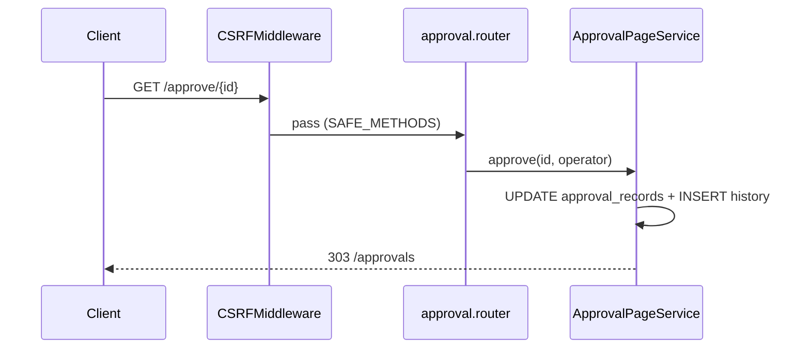

# Center 批准 / 拒绝 — HTTP 方法与 CSRF 风险

## Scope 与证据强度

本页固化 Approval Center 决策表面的 HTTP 方法、鉴权缺口与 CSRF 暴露。强结论：主路径 `/approve/{id}`、`/reject/{id}` 与备用 `/approve_record/{id}`、`/reject_record/{id}` 均为 **GET 写操作**；`CSRFMiddleware` 将 GET 归入 `SAFE_METHODS` 直接放行；活动页面路由 **无** `has_permission` / `can_approve`；UI `confirm()` 可被直链绕过。交叉引用（只读不改）：[`../command-authz-deepen/get_mutation_surface.md`](../command-authz-deepen/get_mutation_surface.md)、[`../approval-center-deepen/approval_center_runtime.md`](../approval-center-deepen/approval_center_runtime.md)。

## 业务规则（稳定 ID）

1. **GAR-R01** 主批准：`GET /approve/{approval_id}` → `ApprovalPageService.approve` → 303 `/approvals`。
2. **GAR-R02** 主拒绝：`GET /reject/{approval_id}` → `reject` → 303 `/approvals`。
3. **GAR-R03** 主路径写 `approval_status`/`approval_result`/`finish_time`，并 `INSERT approval_history`（remark 固定 `""`）。
4. **GAR-R04** 备用 `GET /approve_record/{id}`、`/reject_record/{id}` 只更新记录，**不写历史**；`approve_record` **不**接收 operator。
5. **GAR-R05** `CSRFMiddleware`：`SAFE_METHODS = {GET, HEAD, OPTIONS, TRACE}`；方法命中则 **跳过** token 校验。
6. **GAR-R06** Approval 决策 path **不**在 CSRF exempt 名单需求之外——因其为 GET，本身已安全方法放行。
7. **GAR-R07** 活动 `apps/approval/router.py` 决策路由未见 `has_permission`；`permissions.py` 仅 `scopes_for("approval")` 导出。
8. **GAR-R08** `can_approve`/`can_view_approval` 角色辅助存在于 `legacy_support`，**页面决策路由未调用**。
9. **GAR-R09** Hub/详情模板用 `<a href="/approve/...">` + `onclick=confirm(...)`；无 CSRF hidden field（GET 链接也无法承载表单 token 惯例）。
10. **GAR-R10** UPDATE WHERE 仅 `id=?`：**不**要求原状态 Pending，**不**要求操作者=`approver`。
11. **GAR-R11** 规格 `business_modules/approval.md` 声称 `POST /approve/{id}`、`POST /reject/{id}`；活动实现为 GET——规格与运行时冲突以运行时为准。
12. **GAR-R12** A-022 将「human confirm」定义为浏览器 `confirm`，**不是** V18 Type A `human_confirm` 表单位，也不是 CSRF token。
13. **GAR-R13** v14 residual 仍含同源 GET approve/reject；双注册时胜者 UNKNOWN，但两侧均为 GET 写。
14. **GAR-R14** JSON 只读 API 不执行决策；决策仅页面 GET。
15. **GAR-R15** GET 决策可能被预取、书签、跨站 ``/`<a>`、历史重放触发（取决于浏览器/代理策略）。
16. **GAR-R16** EAOS 必须把 Center 决策改为显式 POST/DELETE command + CSRF + principal + object/approver 校验。

## 决策表面清单

| Path | Method | Server gate | Side effect | Intent proof |
|---|---|---|---|---|
| `/approve/{id}` | GET | none on page router | status Approved + history | UI confirm only |
| `/reject/{id}` | GET | none on page router | status Rejected + history | UI confirm only |
| `/approve_record/{id}` | GET | none | status Approved；无 history | none |
| `/reject_record/{id}` | GET | none | status Rejected；无 history | none |

## 流程

1. 用户（或任意持有会话 cookie 的请求）触发 GET `/approve/{id}`。
2. CSRF middleware 因 SAFE_METHODS 放行。
3. 路由无 module RBAC checker（活动 pages router）。
4. Service UPDATE 记录（+主路径 INSERT history）并 303 回列表。
5. 浏览器历史/重试可再次触发；无 Pending 守卫时可能重复写 Approved。

## 校验（强/弱/缺失）

1. **GAR-V01（强）** 决策路由装饰器为 `@pages_router.get`。
2. **GAR-V02（强）** CSRF SAFE_METHODS 含 GET。
3. **GAR-V03（缺失）** 决策必须 POST + csrf_token。
4. **GAR-V04（缺失）** 操作者必须等于 `approver`。
5. **GAR-V05（缺失）** 必须从 Pending 转换。
6. **GAR-V06（缺失）** 页面 RBAC `has_permission` 接线。
7. **GAR-V07（强/主路径）** 主 approve/reject 写 history。
8. **GAR-V08（缺失/备用）** `*_record` 不写 history、无 operator。
9. **GAR-V09（弱）** UI 仅 Pending 行显示按钮；服务端不强制。
10. **GAR-V10（强）** command-authz 总清单已将 Approval GET 列为无 RBAC GET writes。
11. **GAR-V11（缺失）** 拒绝原因必填（remark 恒空）。
12. **GAR-V12（缺失）** 幂等意图键 / 防重放。

## 数据含义

| 概念 | 含义 |
|---|---|
| safe method | CSRF 豁免方法；**不**证明无副作用 |
| GET mutation | 通过 GET 改变 `approval_records` |
| browser confirm | 客户端提示；无服务端证明 |
| Human Confirm (V18) | Type A 表单位；**不等于** Center confirm |
| A-022 human confirm | Hub 上的 JS confirm 文案要求 |
| operator | 主路径 history 操作者（session username） |
| approver | 记录上指定审批人；决策未强制匹配 |
| approval_result | 与 status 同步写 Approved/Rejected |
| finish_time | 决策完成时间 |
| approve_record path | 无历史、无 operator 的备用写 |
| redirect-after-write | 303 不保护写本身 |
| SameSite/cookie | 不替代 command method + CSRF |
| SAFE_METHODS | csrf.py 常量集合 |
| scopes_for("approval") | 权限常量导出；未接决策路由 |

## 状态词汇

| 术语 | 含义 |
|---|---|
| unguarded GET write | 无 RBAC 的 GET 副作用 |
| guarded GET write | 有 RBAC 仍非安全 command（本中心主路径甚至无 RBAC） |
| history-writing path | `/approve` `/reject` |
| record-only path | `/approve_record` `/reject_record` |
| CSRF-skipped | GET 走 SAFE_METHODS 分支 |
| Spec/runtime skew | 规格 POST vs 实现 GET |

## 证据表

| ID | 观察事实 | 强度 | 只读来源路径 |
|---|---|---|---|
| GAR-E01 | GET approve/reject/record 路由 | 强 | `apps/approval/router.py` |
| GAR-E02 | approve/reject 更新+历史 | 强 | `apps/approval/services.py` |
| GAR-E03 | UPDATE WHERE id=? 无 Pending/approver | 强 | `apps/approval/repository.py` |
| GAR-E04 | SAFE_METHODS 含 GET | 强 | `core/security/csrf.py` |
| GAR-E05 | middleware 注册 CSRF | 强 | `core/security/middleware.py` |
| GAR-E06 | Hub confirm 链接 | 强 | `templates/approvals.html` · `approval_detail.html` |
| GAR-E07 | permissions 未接路由 | 强 | `apps/approval/permissions.py` + `router.py` |
| GAR-E08 | 规格声称 POST | 弱/规格 | `business_modules/approval.md` |
| GAR-E09 | A-022 confirm 路径保留 | 强 | `docs/reports/Business_Strong_A022_Approval_Ops_Report.md` |
| GAR-E10 | command-authz 列入 Approval GET writes | 强 | `../command-authz-deepen/get_mutation_surface.md` |
| GAR-E11 | residual 同源 GET | 弱/双注册 | `apps/approval/v14_residual.py` |
| GAR-E12 | can_approve 角色辅助未接线 | 强 | `runtime/v14/legacy_support.py` |

## UNKNOWN + 已查路径

1. **生产代理/WAF 是否拦截跨站 GET 决策 UNKNOWN。** 已查：csrf.py、middleware、deployment/docs 抽样、command-authz UNKNOWN 列表。
2. **浏览器对带 cookie 的跨站 GET 预取策略 UNKNOWN。** 已查：templates/headers、csrf、approvals.html。
3. **页面路由与 v14_residual 双注册时实际胜者 UNKNOWN。** 已查：`router.py`、`v14_residual.py`、S013、Enterprise_Module_Recovery_Report。
4. **全局 middleware 是否在别处补足 Approval 页面 RBAC UNKNOWN。** 已查：`apps/approval/router.py`、`permissions.py`、`can_*` helpers、permission-surface 交叉意图。
5. **`*_record` 路径是否仍被任何 UI 链接 UNKNOWN。** 已查：templates/approval*、A-022（强调主路径）、S013。
6. **会话 cookie SameSite/HTTPS 生产配置 UNKNOWN。** 已查：csrf/security config 代码面；无生产部署清单。
7. **操作日志是否覆盖每一次 GET 决策 UNKNOWN。** 已查：ApprovalPageService（仅 history 表）、operation log 桥未见。

## 只读来源路径汇总

`apps/approval/router.py` · `apps/approval/services.py` · `apps/approval/repository.py` · `apps/approval/permissions.py` · `apps/approval/v14_residual.py` · `core/security/csrf.py` · `core/security/middleware.py` · `runtime/v14/legacy_support.py` · `templates/approvals.html` · `templates/approval_detail.html` · `business_modules/approval.md` · `docs/reports/Business_Strong_A022_Approval_Ops_Report.md` · `../command-authz-deepen/get_mutation_surface.md` · `../approval-center-deepen/approval_center_runtime.md`
