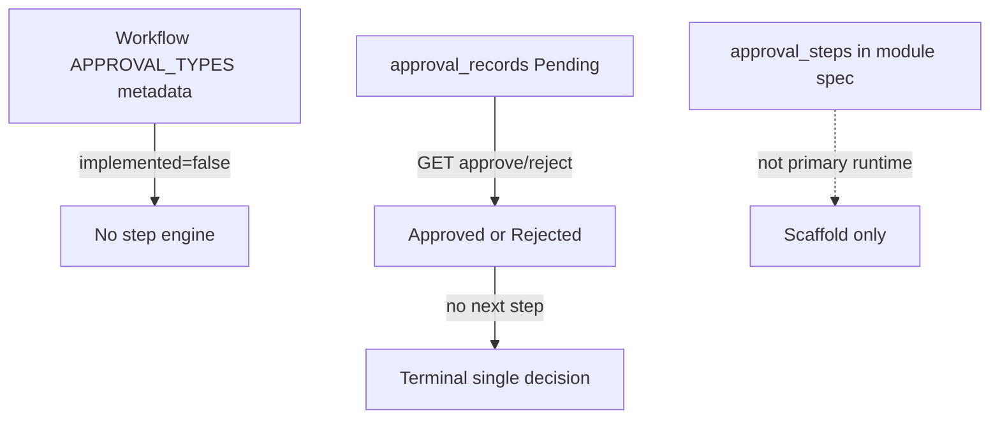

# 多级步骤表 / 引擎 — 是否可执行（非 scaffold）

## Scope 与证据强度

本页判定 Legacy 多级/顺序/并行/条件审批是否具备 **可执行运行时**（步骤实例、推进、会签、条件求值），还是仅有注册元数据/DDL scaffold。强结论：**不可执行**——`ApprovalRegistry` 全部 `implemented=false`；活动 Approval Center 是单记录、单次 GET 决策；规格中的 `approval_steps`/`approval_workflows` **不是**活动 primary 执行面。交叉引用（只读不改）：[`../approval-center-deepen/multi_step_evidence.md`](../approval-center-deepen/multi_step_evidence.md)、[`../approval-center-deepen/approval_center_runtime.md`](../approval-center-deepen/approval_center_runtime.md)。

## 业务规则（稳定 ID）

1. **MSR-R01** `APPROVAL_TYPES` 声明五键：`single_approval`、`multi_approval`、`sequential_approval`、`parallel_approval`、`conditional_approval`。
2. **MSR-R02** `ApprovalRegistry._seed` 对每一类型写入 `implemented: False`。
3. **MSR-R03** `ApprovalRegistry.health()` 返回 `"implemented": False`。
4. **MSR-R04** Workflow Center facade 可将元数据 upsert 到仓储，仍来自未实现核心列表。
5. **MSR-R05** 活动中心决策只 UPDATE 一条 `approval_records`；无 step_no / level / round 字段消费。
6. **MSR-R06** `approval_history` 主路径每次决策插一条 Approved/Rejected；无「进入下一步」编排动作。
7. **MSR-R07** `approval_types.need_workflow=1` 是类型静态标志，不启动 workflow engine。
8. **MSR-R08** `approval_settings.allow_delegate` / `approval_timeout=72` 为种子值；未见步骤超时或委托路由执行。
9. **MSR-R09** `approval_delegation` 表存在；`apps/approval` 活动路径未见读写生效。
10. **MSR-R10** `business_modules/approval.md` 目标拥有 `approval_workflows` / `approval_steps` / `approval_requests`；活动 `primary_table` 是 `approval_records`。
11. **MSR-R11** 单人 `approver` 待办过滤 ≠ 多级链。
12. **MSR-R12** `v15/approval/engine.py` 规格提及「if present」；仓库 **无**该路径。
13. **MSR-R13** `core/capabilities/approval` 为能力壳，不推进步骤实例。
14. **MSR-R14** 不得把重复打开 Approve 页或重复 GET `/approve` 解释为多级。
15. **MSR-R15** `WORKFLOW_CENTER_ENABLED_BY_DEFAULT = False`；审批工作流模块名存在于枚举，不等于引擎启用。
16. **MSR-R16** EAOS 若需要多级，必须新建可执行步骤模型；不能把 Legacy 注册表当运行时。

## 可观察 vs scaffold

| 层 | 实际行为 | 判定 |
|---|---|---|
| 元数据注册 | 5 种审批模型，implemented=false | scaffold |
| 类型/设置种子 | QUOTE… + timeout/delegate 种子 | scaffold |
| 委托 DDL | `approval_delegation` CREATE | scaffold |
| 中心运行时 | Pending → 一次 Approve/Reject | **可执行（单级）** |
| 多级推进 / quorum / 条件 | 未观察到 | **不可执行** |
| 业务回调 | 未观察到 | 缺失 |

## 校验（强/弱/缺失）

1. **MSR-V01（强）** 五类审批键均标记未实现。
2. **MSR-V02（强）** health.implemented == False。
3. **MSR-V03（缺失）** sequential step 表/实例执行路径。
4. **MSR-V04（缺失）** multi/parallel 法定人数或全员同意校验。
5. **MSR-V05（缺失）** conditional 规则引擎绑定 approval decision。
6. **MSR-V06（缺失）** delegation 生效替换 approver 查询。
7. **MSR-V07（缺失）** timeout 自动升级/过期作业。
8. **MSR-V08（强）** 活动 UPDATE 无 step 条件（WHERE id=?）。
9. **MSR-V09（弱）** `need_workflow` 默认 1 不产生实例。
10. **MSR-V10（缺失）** `v15/approval/engine.py` 文件存在。
11. **MSR-V11（强）** repository 无 step/next/advance API。
12. **MSR-V12（缺失）** 规格 `approval_steps` 活动仓库方法。

## 数据含义

| 数据 | 含义 |
|---|---|
| `single_approval` | 元数据键：单人（未实现引擎） |
| `multi_approval` | 元数据键：多人（未实现） |
| `sequential_approval` | 元数据键：顺序多级（未实现） |
| `parallel_approval` | 元数据键：并行（未实现） |
| `conditional_approval` | 元数据键：条件（未实现） |
| `implemented` | 注册表能力标志；当前恒 false |
| `need_workflow` | 类型是否「需要工作流」的静态标志 |
| `allow_delegate` | 设置种子；非运行委托 |
| `approval_timeout` | 设置种子「72」；单位/触发 UNKNOWN |
| `approval_delegation.delegate_user` | 委托目标列；无消费证据 |
| `approval_history` 多行 | 审计事件，非步骤状态机 |
| `approval_requests` / `approval_steps`（规格） | 目标模型名；非活动 primary |
| `TABLE_WORKFLOW_APPROVALS` | Workflow 表名常量；≠ Center 步骤引擎 |
| `V151_WORKFLOW_VERSION` | 版本标签 |

## 状态词汇

| 术语 | 证据地位 |
|---|---|
| Pending/Approved/Rejected | **有** — 单级中心状态 |
| Step N / Level N | **无**执行态 |
| Waiting parallel peers | **无** |
| Condition matched | **无** |
| Delegated | DDL only |
| Scaffold | 元数据/DDL/规格存在但不可驱动业务 |

## 证据表

| ID | 观察事实 | 强度 | 只读来源路径 |
|---|---|---|---|
| MSR-E01 | APPROVAL_TYPES 五键 | 强 | `core/workflow/types.py` |
| MSR-E02 | registry seed implemented=False | 强 | `core/workflow/approval.py` |
| MSR-E03 | facade 透传/upsert 未实现列表 | 强 | `apps/workflow_center/approval_registry.py` |
| MSR-E04 | 单记录 UPDATE 无步骤 | 强 | `apps/approval/repository.py` |
| MSR-E05 | history 仅 Approved/Rejected | 强 | `apps/approval/services.py` |
| MSR-E06 | delegation/settings DDL+种子 | 强/弱 | `runtime/v14/legacy_support.py` |
| MSR-E07 | 规格拥有 workflows/steps | 弱/目标 | `business_modules/approval.md` |
| MSR-E08 | v15/approval 目录不存在 | 强 | `v15/**` glob（0 files under approval engine path） |
| MSR-E09 | Capability 壳无引擎 | 强 | `core/capabilities/approval/service.py` |
| MSR-E10 | Integration：Approval→SO/Quote 无 hook | 强 | `docs/reports/Integration_Queue.md` |
| MSR-E11 | 邻包多级证据结论 | 强 | `../approval-center-deepen/multi_step_evidence.md` |
| MSR-E12 | Workflow center default disabled | 强 | `core/workflow/types.py` (`WORKFLOW_CENTER_ENABLED_BY_DEFAULT`) |

## UNKNOWN + 已查路径

1. **Workflow Center DB 中 upsert 的 approval 行是否被任何 UI 渲染为可配流程 UNKNOWN。** 已查：approval_registry facade、workflow center、apps/approval、templates。
2. **`approval_queue` / `approval_monitor` 邻近 DDL 是否服务多级监控 UNKNOWN。** 已查：`legacy_support.py` 邻近 CREATE、apps/approval。
3. **超时 72 的单位（小时/分钟）与触发器 UNKNOWN。** 已查：default_approval_settings、services、jobs/scripts 抽样。
4. **是否有外部 BPM 系统承接多级 UNKNOWN。** 已查：Integration_Queue、V15、approval apps、business_modules。
5. **LEAVE/EXPENSE 类型是否在其他模块实现独立多级 UNKNOWN。** 已查：default types、apps/approval、finance/expense 路径抽样。
6. **workflow_* 实例表是否被非 Approval Center 路径推进 UNKNOWN。** 已查：core/workflow、apps/workflow_center、apps/approval 决策路径。
7. **历史定制库是否手工维护了未入库的步骤表 UNKNOWN。** 已查：活动代码 primary_table、模块规格、repository API。

## 只读来源路径汇总

`core/workflow/types.py` · `core/workflow/approval.py` · `apps/workflow_center/approval_registry.py` · `apps/approval/repository.py` · `apps/approval/services.py` · `runtime/v14/legacy_support.py` · `business_modules/approval.md` · `core/capabilities/approval/service.py` · `docs/reports/Integration_Queue.md` · `docs/reports/V15_ENTERPRISE_INTELLIGENCE_REPORT.md` · `../approval-center-deepen/multi_step_evidence.md`
