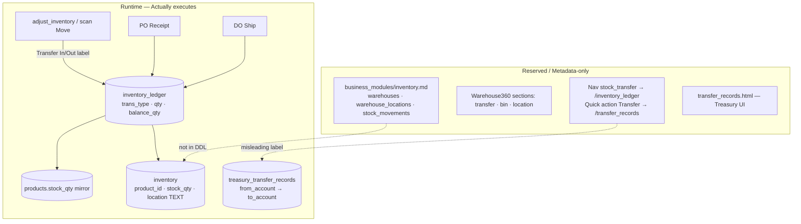

# 调拨、移库与 Transfer 标签

## Scope与证据强度

本页调查仓间调拨、库位移动、在途库存、双边过账与调拨审批。强证据表明扫码 Move 只是对单个库存行做正/负调整，并把类型标为 `Transfer In` 或 `Transfer Out`。仓库/库位缺口交叉引用 [`../fulfillment-deepen/warehouse.md`](../fulfillment-deepen/warehouse.md)。

`templates/transfer_records.html` 属 Finance 资金转账，不是库存调拨证据。未发现库存调拨单、源/目标仓字段或双边原子过账。

## 业务规则（稳定ID）

1. **TR-R01** 运行库存按产品单行汇总，`location` 只是该行的自由文本位置。
2. **TR-R02** 更新 `location` 只修改库存元数据，不改变数量，也不写移动流水。
3. **TR-R03** 扫码仓动作的 Move 接受一个 inventory_id 和带符号 qty，不接受源仓、目标仓或目标库存行。
4. **TR-R04** Move 数量大于零时标记 `Transfer In`，小于零时标记 `Transfer Out`。
5. **TR-R05** Move 复用通用调整：更新同一行余额、同步产品镜像并追加单条流水。
6. **TR-R06** `Transfer Out` 若导致余额为负会被拒绝；`Transfer In` 没有来源库存平衡检查。
7. **TR-R07** 扫码 Move 要求显式 `human_confirm=1`，AI 不能静默移动库存。
8. **TR-R08** Adjust 页面也可直接选择 Transfer In/Out，但只依赖浏览器确认，服务端不验证成对记录。
9. **TR-R09** 流水没有 transfer_id、from_location、to_location、counterpart_ledger_id 或 in_transit 字段。
10. **TR-R10** 运行 DDL 未发现 `inventory_transfer` / transfer order 表。
11. **TR-R11** 模块规范宣称 warehouses、warehouse_locations 与 stock_movements，是目标边界；实际运行只证实扁平 inventory 与 inventory_ledger。
12. **TR-R12** 相同产品若缺库存行，系统只从产品镜像创建一条无 location 的行，不为目标仓建立独立余额。
13. **TR-R13** location 改名和 Transfer 标签可以分别发生，系统不保证二者表达同一真实移动。
14. **TR-R14** 库存流水全局按时间/id展示，不能组合成一张有状态的调拨单。
15. **TR-R15** Finance 的 transfer records 表和页面记录账户资金转账，不能用于推断库存调拨。

## 流程

### 扫码 Move（已证）

1. 扫描/输入产品代码，定位单个库存行。
2. 选择 Move，输入带符号数量。
3. 人工确认。
4. 正数映射 Transfer In，负数映射 Transfer Out。
5. 调用通用库存调整，校验非零与非负结果。
6. 更新同一库存行、产品镜像并写单条流水。

### location 维护（已证）

用户可编辑 `safe_stock` 与自由文本 `location`。该动作不形成数量变动或库位变更流水。

### 真正调拨流程（未证）

未见“建调拨单→源仓预留→源仓出库→在途→目标仓收货→差异关闭”的实体、状态或双边账。

## 校验（强/弱/缺失）

1. **TR-V01（强）** 扫码动作必须找到库存行。
2. **TR-V02（强）** Move 需要 `human_confirm=1`。
3. **TR-V03（强）** Move qty 不得为零。
4. **TR-V04（强）** Transfer Out 后余额不得为负。
5. **TR-V05（强）** Inventory edit 权限控制普通 Adjust/元数据更新入口。
6. **TR-V06（弱）** 页面限制可选 Transfer 标签，但通用服务接受任意 trans_type。
7. **TR-V07（缺失）** 未校验源位置和目标位置必须不同且存在。
8. **TR-V08（缺失）** 未校验 Transfer Out 与 Transfer In 数量成对相等。
9. **TR-V09（缺失）** 未见双边过账原子性或共享调拨幂等键。
10. **TR-V10（缺失）** 未见目标仓容量、SKU 上架规则或库位可用状态。
11. **TR-V11（缺失）** 未见在途丢损、短收、拒收和部分接收校验。
12. **TR-V12（缺失）** location 自由文本无主数据、唯一性或格式校验。

## 数据含义

| 数据 | Legacy 含义 |
|---|---|
| `inventory.id` | Move 操作的唯一余额行 |
| `product_id` | 调整的 SKU |
| `stock_qty` | 产品汇总现存量，不分仓 |
| `location` | 可编辑自由文本位置 |
| `qty`（Move） | 带符号的单边变动量 |
| `Transfer In` | 正向通用调整标签 |
| `Transfer Out` | 负向通用调整标签 |
| `balance_qty` | 单边过账后的产品总余额 |
| `remark` | 扫码 Move 固定说明或人工参考 |
| `products.stock_qty` | 同步的产品总库存镜像 |
| from/to warehouse | 未见运行字段 |
| in-transit qty | 未见运行字段 |
| transfer order/status | 未见运行实体 |
| Finance transfer record | 资金账户转账，不是库存移动 |

## 状态词汇

| 词汇 | 含义/限制 |
|---|---|
| Move | 扫码动作分支 |
| Transfer In | 单行正调整类型 |
| Transfer Out | 单行负调整类型 |
| Human Approved | 扫码动作显式确认 |
| location | 自由文本位置，不是调拨状态 |
| Draft / Released | UNKNOWN；未见库存调拨单 |
| In Transit | UNKNOWN；未见在途库存 |
| Received / Closed | UNKNOWN；未见目标收货与关闭 |

## 证据表

| # | 观察事实 | 强度 | 只读来源路径 |
|---|---|---|---|
| TR-E01 | Scan Move 将正负 qty 映射 Transfer In/Out | 强 | `apps/inventory/services.py` |
| TR-E02 | Move 调用通用单行 adjust | 强 | `apps/inventory/services.py` |
| TR-E03 | Adjust 表单可选择 Transfer 类型 | 强 | `templates/adjust_inventory.html` |
| TR-E04 | Scan 表单没有 source/target 仓位字段 | 强（缺失证据） | `templates/inventory_scan_action.html` |
| TR-E05 | inventory 仅有单一自由文本 location | 强 | `runtime/v14/legacy_support.py` |
| TR-E06 | location 更新不写流水 | 强 | `apps/inventory/repository.py`、`services.py` |
| TR-E07 | ledger 无调拨单和双边关联字段 | 强 | `runtime/v14/legacy_support.py` |
| TR-E08 | 模块规范中的仓库/移动表未在活动 DDL落地 | 中/缺失证据 | `business_modules/inventory.md`、Legacy DDL |
| TR-E09 | Volume010 报告明确无离散 Inventory Transfer 路由 | 强 | `docs/reports/V151E_Volume010_Finance_Inventory_Business_Chain_Extraction_Report.md` |
| TR-E10 | Warehouse 深挖确认运行模型为扁平 SKU | 强（交叉证据） | `../fulfillment-deepen/warehouse.md` |

## UNKNOWN + 已查路径

1. **库存调拨单主表/行表是否存在于其他部署：UNKNOWN。** 已查路径：Legacy DDL、`apps/inventory/`、`business_modules/inventory.md`。
2. **源仓、目标仓及库位主数据：UNKNOWN。** 已查路径：Inventory schema/templates、Warehouse360、fulfillment-deepen/warehouse。
3. **Transfer In 与 Out 的配对规则和共同单号：UNKNOWN。** 已查路径：Inventory service、ledger schema、全库 Transfer 搜索。
4. **在途库存所有权与可用量：UNKNOWN。** 已查路径：Inventory、Procurement、Sales、Finance apps。
5. **部分发运、部分接收和调拨差异处理：UNKNOWN。** 已查路径：Inventory routes/services、templates、`docs/reports/`。
6. **跨租户/公司调拨与权限：UNKNOWN。** 已查路径：tenant migration、Inventory repository、RBAC。
7. **location 修改是否应产生零数量移动流水：UNKNOWN。** 已查路径：update_inventory_meta、edit template、ledger DDL。
8. **Transfer 标签历史数据是否由人工成对录入：UNKNOWN。** 已查路径：流水读写代码和报告；无数据样本审计证据。

## 只读来源路径

- `H:\Workspace\EZAM_CRM - 9.0\apps\inventory\`
- `H:\Workspace\EZAM_CRM - 9.0\apps\product\`
- `H:\Workspace\EZAM_CRM - 9.0\apps\procurement\`
- `H:\Workspace\EZAM_CRM - 9.0\templates\adjust_inventory.html`
- `H:\Workspace\EZAM_CRM - 9.0\templates\inventory_scan_action.html`
- `H:\Workspace\EZAM_CRM - 9.0\templates\inventory_ledger.html`
- `H:\Workspace\EZAM_CRM - 9.0\business_modules\inventory.md`
- `H:\Workspace\EZAM_CRM - 9.0\docs\reports\`
- `H:\Workspace\EZAM_CRM - 9.0\runtime\v14\legacy_support.py`
# Phase-9 Legacy 知识抽取 — Transfer / Relocation / Bin Move

**来源（只读）：** `H:\Workspace\EZAM_CRM - 9.0`  
**抽取范围：** `apps/inventory`、`apps/product`、`apps/procurement`、`templates`、`business_modules`、`docs/reports`、`runtime`（DDL / callsites）  
**排除：** Brain/Twin  
**日期：** 2026-07-23  

---

## 1. 核心结论（Transfer vs Relocation vs Bin Move）

| 概念 | Legacy 9.0 是否存在 | 实际形态 |
|------|---------------------|----------|
| **`inventory_transfer` 表 / 调拨单** | **否（运行层）** | 全库无 CREATE TABLE、无 repository SQL、无专用路由；`business_modules/inventory.md` 仅作规划 |
| **Transfer Out / Transfer In（库存台账）** | **是（标签）** | `inventory_ledger.trans_type` 字符串；对**同一** `inventory` 行做 ±qty delta，**非** source→target 双边过账 |
| **from / to location（库位转移）** | **否** | `inventory.location` 为单行自由文本；Edit 改 location **不写 ledger**；Move 动作**不接收** target bin |
| **单 SKU 库存行** | **是** | 每 `product_id` 至多一行（`fetch_inventory_by_product_id … LIMIT 1`）；qty 为**全局** on-hand |
| **Bin move / relocation** | **否** | 无 bin 主数据、无 relocation 路由；scan “Move” = 数量调整 + Transfer 标签 |
| **两阶段调拨（出→在途→入）** | **否** | 无 in-transit 库存桶、无 transfer order 状态机；单次 POST 即过账 |
| **单阶段调整** | **是** | Adjust / scan Move / PO Receive / DO Ship 均为一次 commit 三写 |
| **审批** | **部分** | scan-action、DO Ship 需 V18 `human_confirm=1`；Adjust 仅浏览器 `confirm()`；**无** `/approvals` 调拨链 |
| **在途（in-transit）** | **仅 UI 占位** | workspace KPI “In Transit” 值为 `—`；无表字段、无 qty 扣减到在途账户 |
| **幂等** | **部分** | PO Receive / DO Ship 有 ledger remark 去重；Transfer In/Out **无**幂等键，重复 POST 重复入账 |
| **Tenant** | **部分 / 弱** | `inventory` DDL **无** `tenant_id`；`utils.get_inventory` 用 tenant dual-read；repository 主路径**未** scoped |

**命名陷阱：** UI/导航多处 “Transfer / Stock Transfer” 指向 **`/transfer_records`** → 实为 **Treasury 银行间转账**（`treasury_transfer_records`），**不是**库存调拨。

---

## 2. 运行 vs 预留结构

| 层 | 资产 | 状态 |
|----|------|------|
| **运行 DDL** | `inventory`, `inventory_ledger` | `runtime/v14/legacy_support.py` §08 已 CREATE |
| **运行 DDL** | `treasury_transfer_records` | Finance §09；**资金**转移 |
| **规划表（未落地）** | `inventory_transfer`, `stock_movements`, `warehouses`, `warehouse_locations` | 仅 `business_modules/inventory.md` |
| **运行 UI — 库存 Move** | `/adjust_inventory/{id}`, `/inventory/scan-action` | `apps/inventory/router.py` |
| **运行 UI — 库位编辑** | `/edit_inventory/{id}` → `location` 文本 | 不改 qty、不写 ledger |
| **预留 UI** | `warehouse.html`, `stock_movements.html` | **文件不存在**；Volume010 报告确认无 legacy 路由 |
| **并行 Object360** | Warehouse360 `transfer` section | `core/object360/warehouse/`；合成 `INV-CENTER`，非仓库主表 |

---

## 3. Transfer Out/In 台账机制

### 3.1 写入路径（两条，同一 service）

| 入口 | 路由 | trans_type 决定方式 | remark 默认 |
|------|------|---------------------|-------------|
| 手工调整 | POST `/adjust_inventory/{id}` | 用户下拉选择 Transfer In / Transfer Out | 用户 remark 或 `INV-{id}` |
| 扫码 Move | POST `/inventory/scan-action` · `warehouse_action=move` | `qty > 0` → Transfer In；`qty < 0` → Transfer Out | `V18-P3b scan-action Move (Human Approved)` |

**共同实现：** `InventoryPageService.adjust_inventory()` → 更新 `inventory.stock_qty` + `products.stock_qty` + `INSERT inventory_ledger`。

### 3.2 不是什么

- **不是**从 warehouse A 减、warehouse B 加的双边分录  
- **不是** `inventory_transfer` 单据驱动  
- **不是** 修改 `location` 字段（location 与 Transfer 台账**解耦**）  
- **不是** Treasury `/add_transfer_record`（银行账户余额转移）

### 3.3 与其他 trans_type 并列

| trans_type | 触发 | 典型 remark |
|------------|------|-------------|
| `PO Receipt` | `receive_purchase` | `PO-{purchase_id}` |
| `DO Ship` | `ship_delivery_order` | `DO-{do_no}` |
| `Manual Adjustment` / `Cycle Count` / `Damage Write-off` | adjust 表单 | 用户输入 |
| `Transfer In` / `Transfer Out` | adjust 或 scan Move | 见上 |

---

## 4. 业务规则（≥12）

| # | 规则 ID | 规则描述 | 权威来源 |
|---|---------|----------|----------|
| R01 | **XFER-SINGLE-ROW** | 库存“调拨”仅作用于**一条** `inventory` 行（按 `inventory_id` 或 `product_id` 解析） | `apps/inventory/repository.py` · `fetch_inventory_by_product_id` LIMIT 1 |
| R02 | **XFER-LABEL-ONLY** | Transfer In/Out 仅为 `inventory_ledger.trans_type` 标签，不创建 transfer 单据或第二库存行 | `apps/inventory/services.py` · `adjust_inventory` |
| R03 | **XFER-SIGN-SCAN** | scan Move：`delta>0` → Transfer In；`delta<0` → Transfer Out（由 qty 符号决定） | `apps/inventory/services.py` · `apply_scan_action` L1043–1055 |
| R04 | **XFER-DUAL-WRITE** | 任意 Transfer 过账同步：`inventory.stock_qty`、`products.stock_qty`（同 delta）、`inventory_ledger` 一行 | `apps/inventory/services.py` · `adjust_inventory` |
| R05 | **XFER-NO-LOCATION** | qty Move **不**更新 `inventory.location`；库位仅经 Edit meta 修改 | `update_inventory_meta` vs `adjust_inventory` 分离 |
| R06 | **LOC-FREE-TEXT** | `inventory.location` 为可搜索的自由文本（如 `A-01-02`），无 warehouse/bin FK | DDL + `templates/edit_inventory.html` |
| R07 | **LOC-EDIT-NO-LEDGER** | 改 safe_stock/location **不过账** ledger | `services.update_inventory_meta` |
| R08 | **XFER-SINGLE-PHASE** | Transfer 无 draft→approve→complete 库存状态；一次 POST 即 commit | router + services |
| R09 | **XFER-NO-IDEMPOTENT** | Transfer In/Out **无** remark/type 去重；重复提交产生多条 ledger | 对比 PO/DO 的 count_*  helper |
| R10 | **PO-DO-IDEMPOTENT** | PO Receive 查 `PO-{id}`；DO Ship 查 `DO-{do_no}` + `trans_type='DO Ship'` | `procurement/repository.py` · `inventory/repository.py` |
| R11 | **SCAN-HUMAN-APPROVE** | scan-action（含 Move）非 cancel/draft 须 `human_confirm=1` | `apply_scan_action` L990–994 |
| R12 | **DO-SHIP-HUMAN-APPROVE** | DO Ship Type A 须 `human_confirm=1` 后调用 `ship_delivery_order` | `apply_do_ship` L1205–1207 |
| R13 | **ADJ-BROWSER-CONFIRM** | 手工 Adjust（含选 Transfer In/Out）仅前端 `confirm()`，无 V18 footer | `templates/adjust_inventory.html` |
| R14 | **XFER-NO-NEG-BAL** | Transfer Out（负 delta）后 on-hand 不得 < 0 | `adjust_inventory` negative_balance |
| R15 | **NAV-TREASURY-TRAP** | 多处 “Transfer Stock” 链到 `/transfer_records`（Treasury），非库存 | `v15/workspace/enrichment.py` · `document/workspace_registry.py` |
| R16 | **TREASURY-TRANSFER** | `/add_transfer_record` 写 `treasury_transfer_records` 并 ±`treasury_bank_accounts.current_balance` | `apps/finance/services.py` · `_legacy_add_transfer_record` |

---

## 5. 校验与门禁（≥8）

| # | 校验点 | 触发条件 | 失败表现 | 来源 |
|---|--------|----------|----------|------|
| V01 | qty_delta ≠ 0 | adjust / scan move | `invalid_qty` / `qty_must_be_positive` | validator + services |
| V02 | new_qty ≥ 0 | 负向 Transfer Out | `negative_balance` | services |
| V03 | inventory 行存在 | adjust / scan | `not_found` | services |
| V04 | human_confirm = 1 | scan-action POST | `v18_human_confirm_required` | `apply_scan_action` |
| V05 | human_confirm = 1 | DO Ship POST | `v18_human_confirm_required` | `apply_do_ship` |
| V06 | RBAC Inventory edit | adjust / scan POST / update meta | Permission Denied | router |
| V07 | RBAC Treasury add | add_transfer_record | Permission Denied | finance router |
| V08 | PO 未重复收货 | receive | ledger count `PO-{id}` > 0 → `already_received` | procurement |
| V09 | DO 未重复发货 | ship | ledger count `DO-{do_no}` > 0 → `already_shipped` | inventory |
| V10 | DO on-hand 充足 | ship 逐行 | `insufficient_stock` | `ship_delivery_order` |
| V11 | scan receive 需 open PO | action=receive | `v18_no_open_po` | `apply_scan_action` |
| V12 | scan ship 需 open DO | action=ship | `v18_no_open_do` | `apply_scan_action` |
| V13 | Treasury from≠to 未强制 | add_transfer_record | **无校验**（可选同账户） | finance services |
| V14 | location 格式/存在性 | update_inventory | **无校验** | 任意字符串 |

---

## 6. 数据对象与字段（≥10）

| # | 对象/表 | 字段/含义 | Transfer 相关 |
|---|---------|-----------|---------------|
| D01 | `inventory` | `id`, `product_id`, `stock_qty`, `safe_stock`, `location` | **唯一**运行库存行；location 与 transfer qty **独立** |
| D02 | `inventory_ledger` | `trans_type`, `qty`, `balance_qty`, `remark`, `create_time` | Transfer In/Out 存于此；**无** from_loc / to_loc |
| D03 | `products` | `stock_qty` | Transfer 时镜像 delta |
| D04 | ledger.`trans_type` | `Transfer In` / `Transfer Out`（最长 64 字符） | 非 FK、非 enum 表 |
| D05 | ledger.`qty` | 有符号 delta（In 为正，Out 为负） | scan Move 用符号自动选类型 |
| D06 | ledger.`balance_qty` | 过账后该产品余额快照 | 单产品全局余额 |
| D07 | ledger.`remark` | 业务参考 | Transfer **无**标准单号格式 |
| D08 | `treasury_transfer_records` | `transfer_no`, `from_account_id`, `to_account_id`, `amount` | **资金**转移；与 inventory **无关** |
| D09 | **规划** `stock_movements` | business_modules 声明 | **schema 不存在** |
| D10 | **规划** `warehouses` / `warehouse_locations` | 模块规范 | **schema 不存在** |
| D11 | **规划** `inventory_transfer` | 用户/蓝图常见名 | **全库无 DDL/SQL** |
| D12 | Warehouse360 合成 | `INV-CENTER`, `Inventory Center`, id=1 | `core/object360/warehouse/runtime.py`；metadata 非真实仓 |
| D13 | KPI “In Transit” | enrichment 占位 `—` | 无数据绑定 |

**Runtime DDL（Inventory Center）：** 仅 `inventory`、`inventory_ledger`（`runtime/v14/legacy_support.py` L1271–1311）。

---

## 7. 路由与 UI 对照

| 类型 | 路径 | 实际域 | 模块 |
|------|------|--------|------|
| 库存台账 | GET `/inventory_ledger` | 全部 movement 含 Transfer | `apps/inventory/router.py` |
| 手工 Transfer | GET/POST `/adjust_inventory/{id}` | trans_type 下拉 | 同上 |
| 扫码 Move | GET/POST `/inventory/scan-action` | Move → Transfer In/Out | 同上 |
| 库位编辑 | GET `/edit_inventory/{id}` POST `/update_inventory/{id}` | 仅 location 文本 | 同上 |
| **Treasury Transfer** | GET `/transfer_records` POST `/add_transfer_record` | 银行账户 | `apps/finance/router.py` |
| Treasury 360 | GET `/transfer_record/{id}` | 占位 KPI | finance + `transfer_record_360.html` |
| Nav “Stock Transfer” | → `/inventory_ledger` | **仅查看 ledger** | `docs/reports/Navigation_Report.md` |
| Quick “Transfer Stock” | → `/transfer_records` | **Treasury** | `v15/workspace/enrichment.py` |
| **未注册** | `/warehouse`, `/stock_movements` | 规划 | business_modules only |

**关键模板：**

- `templates/adjust_inventory.html` — Transfer In/Out 选项  
- `templates/inventory_scan_action.html` — Move 单选 + qty  
- `templates/edit_inventory.html` — Location/bin 自由文本  
- `templates/inventory_ledger.html` — movement 列表  
- `templates/transfer_records.html` — **Treasury** from/to **account**（非库位）

---

## 8. 流程：单阶段 vs 两阶段

### 8.1 库存 “Transfer”（单阶段）

1. 用户打开 Adjust 或 Scan-action（已解析 `inventory_id`）。  
2. 输入 ±qty（或 scan 默认 qty=1）。  
3. （scan）勾选 Human Approved → `human_confirm=1`。  
4. `adjust_inventory` 一次 commit：inventory + products + ledger（Transfer In/Out）。  
5. **无**中间 “在途” 状态、**无**第二仓 second leg。

### 8.2 库位 “Relocation”（仅 meta）

1. Edit inventory → 修改 `location` 文本 → Save。  
2. **不**写 ledger、**不**动 qty。  
3. 无法证明货物从 bin A 移到 bin B 的审计链（除非人工 Adjust + remark）。

### 8.3 PO / DO（两阶段业务，非仓间调拨）

| 流程 | 阶段 1 | 阶段 2 | ledger |
|------|--------|--------|--------|
| 采购 | PO Draft → Approve → Open | `/receive_purchase` → Received | `PO Receipt` |
| 销售出库 | SO → DO Open | `/delivery_order/{id}/ship` → Shipped | `DO Ship` |

Approve 与库存过账**分离**（PO receive / DO ship 为独立 HTTP 步），但仍为**单仓总量**增减，非 A→B 调拨。

### 8.4 Treasury Transfer（单阶段，金融）

1. POST `/add_transfer_record`（from_account_id, to_account_id, amount）。  
2. INSERT `treasury_transfer_records` + UPDATE 两账户 `current_balance`。  
3. 与 `inventory` **零耦合**。

---

## 9. 幂等、在途、Tenant

| 主题 | 结论 | 证据 |
|------|------|------|
| **幂等 — PO** | `count_inventory_ledger_for_po(purchase_id)` 查 `trans_type='PO Receipt' AND remark='PO-{id}'` | `apps/procurement/repository.py` |
| **幂等 — DO** | `count_inventory_ledger_for_do(do_no)` 查 `trans_type='DO Ship' AND remark='DO-{no}'` | `apps/inventory/repository.py` |
| **幂等 — Transfer** | **无**；每次 adjust 新 ledger 行 | 无 count helper |
| **在途** | KPI 占位；DO Shipped 不保留 in-transit qty 字段 | `v15/workspace/enrichment.py` L298 |
| **Tenant — DDL** | `inventory` / `inventory_ledger` CREATE **无** `tenant_id` | `legacy_support.py` |
| **Tenant — 读** | `apps/inventory/utils.get_inventory` 经 `scoped_one` dual-read | `apps/_tenant_query.py` |
| **Tenant — 写** | repository `adjust_inventory` SQL **无** tenant filter/stamp | `apps/inventory/repository.py` |

---

## 10. 证据索引（≥8）

| # | 证据 | 绝对路径 | 证明内容 |
|---|------|----------|----------|
| E01 | Transfer In/Out 逻辑 | `H:\Workspace\EZAM_CRM - 9.0\apps\inventory\services.py` L1043–1055, L154–204 | scan Move 符号 → trans_type；三写 |
| E02 | Adjust 下拉含 Transfer | `H:\Workspace\EZAM_CRM - 9.0\templates\adjust_inventory.html` L45–51 | UI 标签 |
| E03 | scan Move UI | `H:\Workspace\EZAM_CRM - 9.0\templates\inventory_scan_action.html` L63–66 | warehouse_action=move |
| E04 | location 自由文本 | `H:\Workspace\EZAM_CRM - 9.0\templates\edit_inventory.html` L48–49 | 与 qty 分离 |
| E05 | inventory DDL 无 transfer 表 | `H:\Workspace\EZAM_CRM - 9.0\runtime\v14\legacy_support.py` L1271–1311 | 仅 inventory + ledger |
| E06 | 规划表清单 | `H:\Workspace\EZAM_CRM - 9.0\business_modules\inventory.md` L63–72 | stock_movements 等未落地 |
| E07 | Volume010 无 Stock In/Out 路由 | `H:\Workspace\EZAM_CRM - 9.0\docs\reports\V151E_Volume010_Finance_Inventory_Business_Chain_Extraction_Report.md` L67–72 | 明确 limitation |
| E08 | Treasury transfer 路由 | `H:\Workspace\EZAM_CRM - 9.0\apps\finance\router.py` L329–351 | `/transfer_records` owner |
| E09 | Treasury transfer SQL | `H:\Workspace\EZAM_CRM - 9.0\apps\finance\services.py` L1764–1847 | treasury_transfer_records |
| E10 | Treasury 模板 from/to account | `H:\Workspace\EZAM_CRM - 9.0\templates\transfer_records.html` L37–48 | 非库位 |
| E11 | Nav stock_transfer → ledger | `H:\Workspace\EZAM_CRM - 9.0\docs\reports\Navigation_Report.md` L226 | 只看流水 |
| E12 | Warehouse360 transfer section | `H:\Workspace\EZAM_CRM - 9.0\core\object360\warehouse\warehouse_registry.py` L24 | 架构预留 |
| E13 | INV-CENTER 合成仓 | `H:\Workspace\EZAM_CRM - 9.0\core\object360\warehouse\runtime.py` L16–26 | 非主数据 |
| E14 | PO 幂等 | `H:\Workspace\EZAM_CRM - 9.0\apps\procurement\services.py` L257–263 | already_received |
| E15 | DO 幂等 | `H:\Workspace\EZAM_CRM - 9.0\apps\inventory\services.py` L735–740 | already_shipped |

---

## 11. UNKNOWN（≥7，含已查绝对路径）

| # | UNKNOWN | 已查绝对路径 | 说明 |
|---|---------|--------------|------|
| U01 | **`inventory_transfer` 表**是否曾存在于更旧 DB  dump | `H:\Workspace\EZAM_CRM - 9.0\runtime\v14\legacy_support.py`（全文）、`H:\Workspace\EZAM_CRM - 9.0\database\`、`H:\Workspace\EZAM_CRM - 9.0\plugins\`、`H:\Workspace\EZAM_CRM - 9.0\backups\pre_phase2_app.py`（grep inventory_transfer） | **无匹配** |
| U02 | **`stock_movements` / `warehouse_locations` 运行 SQL** | `H:\Workspace\EZAM_CRM - 9.0\apps\inventory\repository.py`、`H:\Workspace\EZAM_CRM - 9.0\apps\procurement\repository.py`、全 apps grep | **无引用** |
| U03 | **Bin 级 relocation 历史**是否另有隐藏表 | `H:\Workspace\EZAM_CRM - 9.0\runtime\v14\legacy_support.py`（§08 Inventory）、`H:\Workspace\EZAM_CRM - 9.0\database\v151_logistics_center_schema.py` | 物流 schema **metadata_only**；无 bin move |
| U04 | **Transfer 是否应写 `location` 变更审计** | `H:\Workspace\EZAM_CRM - 9.0\apps\inventory\services.py`（update_inventory_meta）、`history.py` | meta 更新**无** history hook |
| U05 | **在途 qty**是否有未挂载模块 | `H:\Workspace\EZAM_CRM - 9.0\apps\shipment\`、`H:\Workspace\EZAM_CRM - 9.0\business_modules\shipment.md`、grep `in_transit` in apps/inventory | enrichment KPI 仅占位 |
| U06 | **多仓 transfer 是否在 V14 app.py 未提取段** | `H:\Workspace\EZAM_CRM - 9.0\docs\reports\V151E_Volume010_Finance_Inventory_Business_Chain_Extraction_Report.md`、`Enterprise_Module_Recovery_Report.md` | 报告声明 **No discrete Stock In/Out/Warehouse Location routes** |
| U07 | **Transfer 审批链** | `H:\Workspace\EZAM_CRM - 9.0\apps\approval\`、`H:\Workspace\EZAM_CRM - 9.0\business_modules\approval.md`、inventory router grep approval | Adjust/Move **未**接 approvals |
| U08 | **tenant_id 迁移脚本**是否后续追加 inventory 列 | `H:\Workspace\EZAM_CRM - 9.0\core\database\tenant_scope.py`、`H:\Workspace\EZAM_CRM - 9.0\database\phase3_indexes.sql` | DDL 无列；dual-read 为防御性 |
| U09 | **`/transfer_records` 链到 inventory 的历史意图** | `H:\Workspace\EZAM_CRM - 9.0\document\workspace_registry.py` L619、`v15\workspace\enrichment.py` L303 | 命名混淆；**运行时指向 Treasury** |
| U10 | **Warehouse360 transfer section 运行 renderer** | `H:\Workspace\EZAM_CRM - 9.0\core\object360\warehouse\`、`grep transfer in apps/inventory/runtime.py` | section 注册存在；**无独立 transfer 页面** |

---

## 12. 概念辨析速查

### 12.1 Transfer In/Out vs 调拨单

- **相同点：** 都改变 on-hand qty 并留 ledger。  
- **不同点：** Legacy Transfer **无**单据号、无 from/to 仓、无在途、无第二 leg；调拨单（规划）未实现。

### 12.2 Move vs Relocation vs Bin move

| 术语 | Legacy 行为 |
|------|-------------|
| **Move**（scan） | ±qty + Transfer In/Out ledger |
| **Relocation** | **无**专用功能；仅 Edit `location` 文本 |
| **Bin move** | **无** bin 实体；location 字符串可手改 |

### 12.3 `/transfer_records` vs 库存调拨

- **Treasury：** 银行账户 from/to、amount、`treasury_transfer_records`。  
- **Inventory：** 应使用 `/adjust_inventory` 或 `/inventory/scan-action`（Move），结果在 `/inventory_ledger` 查看。  
- **导航债务：** Inventory Center quick action “Transfer” 目前链到 Treasury（R15）。

### 12.4 单 SKU 行 vs 多仓

- 运行模型：**一 product 一行 inventory**，`stock_qty` 为总量。  
- 无法表达 “Warehouse A 有 5、Warehouse B 有 3”；Transfer In/Out 只是总量增减标签。

---

## 13. 对 EAOS 迁移的建议（摘录）

1. **勿将** `treasury_transfer_records` **误建模为** `inventory_transfer`。  
2. 若需真仓间调拨：需新增 transfer order 表、from/to location FK、双边 ledger 或 in-transit 桶；Legacy **无**可复用运行逻辑。  
3. `Transfer In/Out` trans_type 可映射为 “单边调整原因码”，**不是** inter-warehouse transfer 业务对象。  
4. 修正导航：`Transfer Stock` 应指向库存 Move/Ledger，而非 `/transfer_records`（除非明确是 Treasury 模块）。  
5. 幂等：PO/DO 模式（remark + trans_type count）可复用；Transfer 需新引入 client token 或 transfer_no。

---

*Phase-9 只读抽取 · 未修改 `H:\Workspace\EZAM_CRM - 9.0` 任何文件*
